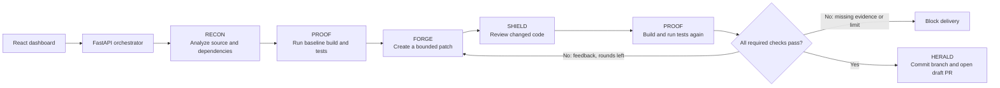

<div align="center">
  
  <h1>VASUKI</h1>
  <p><strong>Find the flaw. Patch it. Prove it.</strong></p>
  <p>An agent-assisted security patch pipeline that checks a fix against the original tests before it opens a draft pull request.</p>
  <p>
    <a href="https://vasuki.dhanrajgupta.xyz">Dashboard preview</a> ·
    <a href="https://github.com/dhanrajgupta2736/vasuki-security-lab">Demo repository</a> ·
    <a href="https://github.com/dhanrajgupta2736/vasuki-security-lab/pull/7">Example verified PR</a>
  </p>
  <p><a href="https://raw.githubusercontent.com/dhanrajgupta2736/pvg_vasuki/main/docs/demo/walkthrough.mp4">Watch the 15-second walkthrough (MP4)</a></p>
</div>

<p align="center">
  <a href="https://raw.githubusercontent.com/dhanrajgupta2736/pvg_vasuki/main/docs/demo/walkthrough.gif"></a>
</p>

VASUKI takes a GitHub repository through baseline testing, supported vulnerability analysis, a bounded patch-and-review loop, and isolated post-patch verification. A successful run creates a branch and a **draft** pull request with its rationale and evidence. A human reviews and merges it.

> **Hosted dashboard:** [vasuki.dhanrajgupta.xyz](https://vasuki.dhanrajgupta.xyz) is currently a UI preview. The Oracle deployment and local tunnel workflow are described in the [runbook](docs/presentation-runbook.md).

## At a glance

| | |
|---|---|
| **Workflow** | RECON → PROOF baseline → FORGE → SHIELD → PROOF → HERALD |
| **Verified runs** | Three end-to-end repository runs opened draft PRs and passed all 9 recorded workflow checks. |
| **Repair loop** | Review or test feedback can return to FORGE for another bounded patch cycle. |
| **Delivery** | A separate patch branch and draft PR; the pipeline never merges to the base branch. |
| **Current focus** | Python repositories with pytest; selected Flask/SQLite source patterns and Python dependency advisories. |

## Screenshots

<table>
  <tr>
    <td align="center"><strong>Repository intake</strong><br><a href="https://raw.githubusercontent.com/dhanrajgupta2736/pvg_vasuki/main/docs/demo/brutalist-landing.png"></a></td>
    <td align="center"><strong>Agent run</strong><br><a href="https://raw.githubusercontent.com/dhanrajgupta2736/pvg_vasuki/main/docs/demo/brutalist-live.png"></a></td>
  </tr>
  <tr>
    <td align="center"><strong>Verified result</strong><br><a href="https://raw.githubusercontent.com/dhanrajgupta2736/pvg_vasuki/main/docs/demo/brutalist-verified.png"></a></td>
    <td align="center"><strong>Review evidence</strong><br><a href="https://raw.githubusercontent.com/dhanrajgupta2736/pvg_vasuki/main/docs/demo/review-checks.jpg"></a></td>
  </tr>
</table>

The animated GIF above is a quick tour; the MP4 link opens the same walkthrough for playback or download. More evidence: [before/after tests](docs/demo/test-comparison.jpg), [verified diff](docs/demo/verified-diff.jpg), and [draft PR view](docs/demo/draft-pr.jpg).

## What a run does



- **RECON** identifies supported source patterns and Python dependency advisories. Findings include a CWE or advisory where evidence supports one; the scanner does not invent CVE identifiers.
- **PROOF** captures the original build and test results before any patch. It compares named test cases afterward, checks test inputs remain unchanged, and blocks missing or regressed evidence.
- **FORGE** proposes a targeted patch using the configured model, with a narrow AST repair path for selected patterns. The event timeline records which engine produced each change.
- **SHIELD** re-checks source rules and syntax, then asks an independent LangChain-backed model review to assess the actual diff and changed files. A failed review or test sends concrete feedback back to FORGE, within the configured repair limit.
- **HERALD** publishes only after the required checks pass. It commits to a separate branch and opens a draft PR with the change rationale and run evidence.

The validation score summarizes recorded checks; it is **not** a probability that a repository is secure. Automated results are evidence for human review, not a merge decision.

### Runner boundaries

Repository builds and tests run in Docker snapshots as a non-root user, with resource limits, dropped capabilities, no host mounts, and networking disabled during repository installation, build, and test execution. Dependency wheels are prepared before the isolated phase. The API host controls Docker and is therefore trusted; this prototype is not a hardened multi-tenant service.

## Recent verification evidence

The included deliberately vulnerable repositories provide repeatable examples. These Oracle-backed runs opened real draft PRs:

| Scenario | Before | After | Repair cycles | Evidence |
|---|---:|---:|---:|---|
| Flask app: SQL injection, traversal, and profile authorization | 6/11 passing | 11/11 passing | 2 | [Draft PR #7](https://github.com/dhanrajgupta2736/vasuki-security-lab/pull/7) |
| Standalone SQLite utility | 7/10 passing | 10/10 passing | 1 | [Draft PR #1](https://github.com/dhanrajgupta2736/vasuki-ledger-lab/pull/1) |
| Packaged app on an older release branch | 7/13 passing | 13/13 passing | 1 | [Draft PR #8](https://github.com/dhanrajgupta2736/vasuki-security-lab/pull/8) |

Each run passed all 9 recorded core workflow checks. This is measured evidence for these scenarios, not a claim of broad language or vulnerability coverage. See the [rehearsal notes](docs/presentation-runbook.md).

## Tech stack

| Area | Tools |
|---|---|
| Dashboard | React 19, Vite, Framer Motion, Lucide React, Recharts |
| API and orchestration | Python 3.11+, FastAPI, Pydantic, SQLAlchemy; SQLite by default, optional Redis/PostgreSQL configuration |
| Agent/model flow | LangChain Core prompt, runnable, and output-parser primitives; OCI Generative AI (Gemini 2.5 Flash by default) or optional Groq inference |
| Security analysis | Native Python AST rules for selected Flask/SQLite patterns, `pip-audit` for Python dependencies, optional Semgrep mode |
| Repository and verification | GitPython, GitHub API, Docker build/test snapshots, pytest/JUnit evidence |
| Deployment and integrations | Oracle Cloud Infrastructure VM and Generative AI, optional n8n intake workflow, Cloudflare Workers for dashboard delivery and API routing |

LangChain provides structured model invocation and review in the agent flow. The FastAPI orchestrator owns the workflow, deterministic checks, retry budget, and publication gates; n8n is an optional intake/status integration rather than the patching engine.

## Run locally

### Requirements

- Python 3.11 or newer
- Node.js and npm
- Git
- Docker Engine for real repository build/test runs
- GitHub credentials with access to the target repository; an LLM provider configuration for model-assisted review and patching

### Start the dashboard and API

From the repository root in PowerShell:

```powershell
python -m pip install -r backend/requirements.txt
Copy-Item backend/.env.example backend/.env
# Edit backend/.env and add the credentials/configuration you intend to use.
npm run build
python -m uvicorn main:app --app-dir backend --host 127.0.0.1 --port 8000
```

Open [http://127.0.0.1:8000](http://127.0.0.1:8000). The API health endpoint is `/api/health`; interactive API docs are at `/docs`.

Configure either OCI Generative AI (the default provider, using OCI config or instance-principal auth) or `GROQ_API_KEY`. Set `GITHUB_TOKEN` for private repositories or PR publication. Keep credentials in `backend/.env`; do not commit that file. The full variable list and safe defaults are in [`backend/.env.example`](backend/.env.example).

For frontend development, run `npm run dev` from the root and open the Vite URL it prints. The Vite dev server proxies API requests to local port 8000.

### Oracle deployment and demo fallback

The Oracle VM deployment scripts, managed SSH tunnel, optional n8n workflow, and presentation launcher are described in the [runbook](docs/presentation-runbook.md).

To view saved run evidence without a live model or Oracle connection, use `./ops/start_offline_demo.ps1` and open `http://127.0.0.1:18888/offline.html`. The offline page is a recorded run, not a live scan. The bundled API demo is also available, but labels its host-side runner as trusted; real GitHub submissions require Docker isolation.

## Checks

```powershell
python -m pytest backend/tests -q
npm run build
```

The backend tests cover patch boundaries, review and retry behavior, and verification gates. The deliberately vulnerable [demo repository](https://github.com/dhanrajgupta2736/vasuki-security-lab) is designed to show the before/after behavior.

## Scope and limitations

VASUKI is currently a Python/pytest prototype. Native source analysis and deterministic AST repairs cover selected Flask/SQLite patterns; Python dependency advisories are checked from supported requirements declarations. Model-generated fixes for other findings are not broadly validated across frameworks or vulnerability classes. Semgrep mode is optional and does not by itself establish that a fix is correct.

Repositories need a supported, runnable test suite. Missing or uncollected tests, unavailable Docker, failed builds, changed test inputs, unresolved findings, or an exhausted repair budget block PR publication. Other languages, arbitrary repository layouts, source-only Python dependencies, and unrestricted multi-tenant hosting are outside the verified scope. A successful run does not replace maintainer review; only a human should merge the draft PR.

## Project links

- [Hosted dashboard UI](https://vasuki.dhanrajgupta.xyz)
- [Security demo repository](https://github.com/dhanrajgupta2736/vasuki-security-lab)
- [Example application draft PR](https://github.com/dhanrajgupta2736/vasuki-security-lab/pull/7)
- [Example older-branch draft PR](https://github.com/dhanrajgupta2736/vasuki-security-lab/pull/8)
- [Deployment and demo runbook](docs/presentation-runbook.md)
