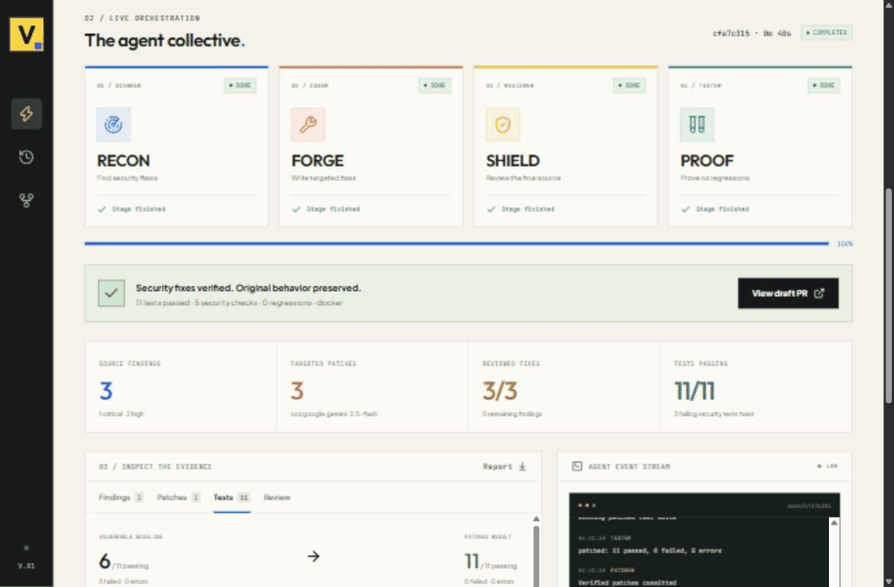
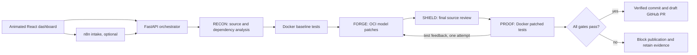

# VASUKI — Autonomous security patch pipeline

Hack-a-Night 2026 · Team Soul Celestia

Submit a GitHub repository and watch four specialized agents identify security
flaws, generate targeted changes, review the final source, and execute unchanged
tests. A passing run commits the verified source and opens a draft GitHub PR
with baseline and patched test evidence. A failed gate blocks publication.

**Verified example:** [automatically generated draft PR](https://github.com/dhanrajgupta2736/vasuki-security-lab/pull/1).
Five consecutive final Oracle runs fixed all three seeded flaws in one repository,
with **11/11 tests passing**, five exploit checks blocked, and no regressions.
Mean backend execution was **55.16 seconds** (range 39.79–83.06 seconds).
One laptop observation took longer because its SSH tunnel disconnected;
[the full measured timings](docs/demo/rehearsals.json) retain both clocks.

[Presentation runbook](docs/presentation-runbook.md) · [offline recorded evidence](docs/demo/offline.html)

Recorded UI walkthrough of the actual completed run and its draft PR:



## Presentation demo

Use [vasuki-security-lab](https://github.com/dhanrajgupta2736/vasuki-security-lab).
Leave branch and project directory blank; keep draft PR publication enabled.

The deliberately vulnerable baseline has three real flaws: SQL injection
(CWE-89), directory traversal (CWE-22), and missing profile authorization
(CWE-639). Its eleven tests include six normal behavior checks and five exploit
checks. The expected result is **6 passing / 5 failing before, 11 passing after**.
The pipeline edits implementation files, preserving the test suite.

1. Open the dashboard. Start the pipeline with the demo repository URL.
2. Show the live RECON → FORGE → SHIELD → PROOF activity and event stream.
3. Inspect the three findings and the generated source diff.
4. Open Tests to show named before/after results, the Docker runner, and no
   missing or regressed tests.
5. Open the real draft PR and inspect its commit and executed evidence.

Every run has a different scan ID and patch branch. Keep `main` vulnerable for
repeat demos; merging a draft PR would change the baseline.

The bundled security lab button runs the same fixture without GitHub publication.
It is a useful fallback when internet or the container runner is unavailable.
Its runner is accurately labelled `trusted-bundled-process`; GitHub submissions
always require Docker and never execute tests on the backend host.

## Architecture and verification



- Source analysis uses auditable Python AST rules for supported SQLite/Flask
  patterns. Optional `SCANNER_MODE=semgrep` also uses installed Semgrep rules.
- Dependency advisories come from `pip-audit`; source findings have CWE classes
  and never receive invented CVE identifiers.
- FORGE uses real OCI Generative AI inference (the current prototype uses
  `google.gemini-2.5-flash` in Mumbai). Model failures can fall back to a narrow
  AST repair engine; the event stream records which engine actually generated
  each patch. No fabricated model approval or test results are returned.
- SHIELD repeats source rules, checks syntax, and rejects unresolved or new
  findings. Rule clearance is not a statistical probability of security.
- PROOF records JUnit cases for both snapshots. Existing passing tests must
  remain passing, no baseline tests may disappear, and the patched suite must
  exit successfully. Missing suites, failed installs, missing evidence, and
  unavailable Docker block publication.
- Reviewer findings and failed test output can each trigger one bounded repair
  round, followed by repeated source review and a complete test run. Supported
  AST repairs are labelled explicitly when model feedback remains unverifiable.
- Docker snapshots exclude credentials and Git metadata. Tests run as UID 1000
  with limited CPU/memory, dropped capabilities, no host mounts, and networking
  disconnected after dependency installation.
- Commits occur only after validation. Push credentials are transient Git
  headers; tokens are never stored in repository remote URLs. Repositories
  without write access are forked before creating a draft PR.
- JSON evidence, diffs, PR rationale, test reports, and events are retained in
  `backend/artifacts/<scan-id>` or the Oracle API data volume.

## Run on the laptop

Python 3.11+, Git and Node.js are required. Configure `backend/.env` from
`backend/.env.example`, providing your GitHub token and OCI configuration.

```powershell
python -m pip install -r backend/requirements.txt
npm --prefix frontend install
npm run build
cd backend
python -m uvicorn main:app --host 127.0.0.1 --port 8000
```

Open `http://127.0.0.1:8000`. The backend serves the built UI on the same origin.
For UI development, run `npm run dev` from the repository root and use port 5173.
Its Vite proxy targets local backend port 8000. The teammate's original dashboard
remains in `frontend/src/App.jsx`; the live presentation view is
`frontend/src/LiveDashboard.jsx`.

Without local Docker, use the bundled lab or the Oracle presentation tunnel.

## Oracle deployment

The prototype uses the existing Ubuntu VM. The dashboard, orchestrator, model
access, n8n, and Docker test runner run on Oracle. A laptop SSH tunnel exposes
only the dashboard and n8n locally; cloud ports remain bound to loopback.

`ops/oracle_bastion.py` establishes a laptop-IP-restricted managed SSH session,
using the OCI CLI/SDK configuration and an ignored local key. Sessions expire
after three hours; create a fresh session before the presentation if needed.
The deployment scripts use a serial runner and swap for the 1 GB Oracle micro VM.

```powershell
python ops/oracle_bastion.py
# Once the session is ACTIVE:
python ops/oracle_ssh.py --tunnel
```

Open `http://127.0.0.1:18000` for the Oracle dashboard and
`http://127.0.0.1:15678` for n8n. Keep the tunnel process running.
On this presentation laptop, `./ops/start_presentation.ps1` restores the tunnel.
`./ops/start_offline_demo.ps1` serves saved evidence at
`http://127.0.0.1:18888/offline.html` without Oracle or model connectivity.

Deployment files: `ops/compose.oracle.yml`, `ops/bootstrap_oracle.sh`, and
`ops/package_prototype.py`. Build the frontend before packaging. Transfer the
archive and a minimal `backend/.env` over SSH, then run the bootstrap script.
The API uses OCI instance principal authentication; its dynamic group requires
inference permission. GitHub credentials stay in the remote `.env`, outside the
image. SQLite, artifacts and n8n state have persistent Docker volumes.

The generated `vasuki_n8n_soar_workflow.json` accepts a POST containing
`repo_url`, optional `branch` and `project_path`, and `publish_pr`. It submits
the actual backend run, returns its scan ID, and polls until completed, blocked,
or failed. Publish it with the n8n CLI, then restart n8n. The dashboard can route
submissions through this workflow when the webhook is configured.

## Checks and prototype scope

```powershell
python -m pytest backend/tests -q
npm run build
```

The checks exercise real exploit behavior before and after repairs, preservation
of passing tests, blocking on lost coverage or execution failure, URL validation,
and patch path boundaries. The vulnerable testbed's five failures are intentional.

This is a working prototype for supported Python repositories with pytest.
Native source rules cover specific Flask/SQLite patterns, not every language or
security flaw. Dependency auditing currently covers explicitly declared Python
requirements; its availability and failures appear in events. Node projects
currently block when no structured test evidence is available. Source review
and tests reduce demonstrated risk; a draft PR still requires human review for
broader correctness. Password hashing, production authentication, unrestricted
language coverage, and distributed runners are outside this demo's scope.
