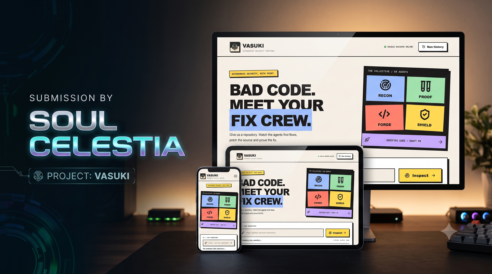
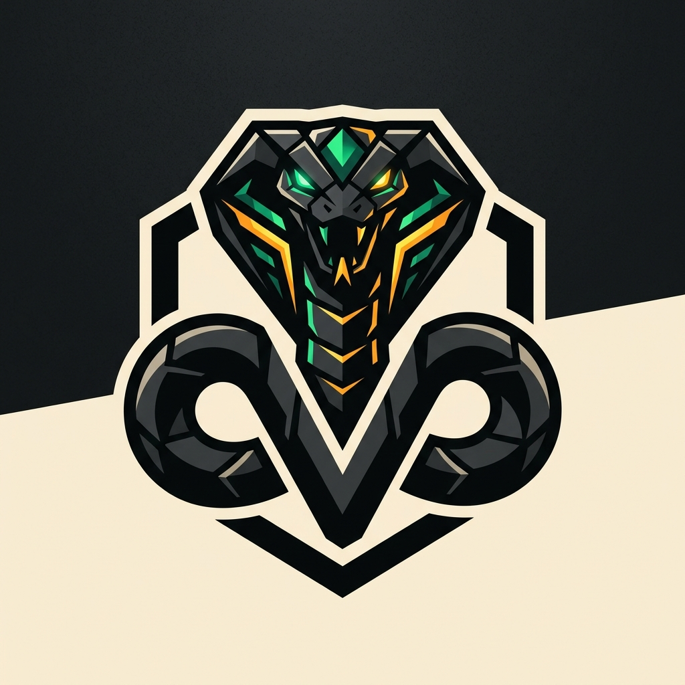
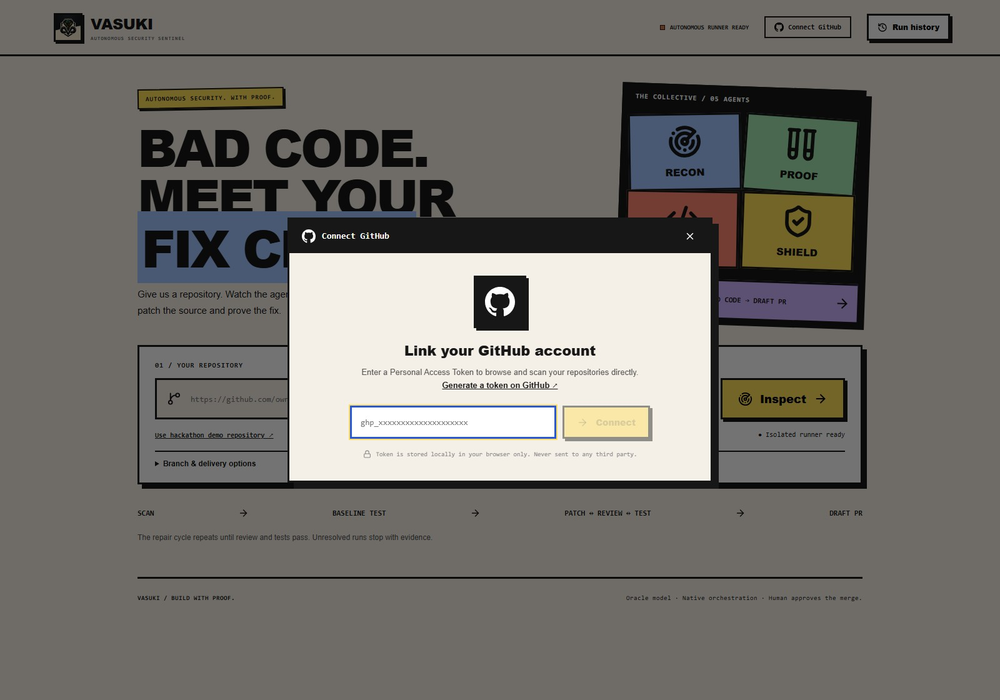
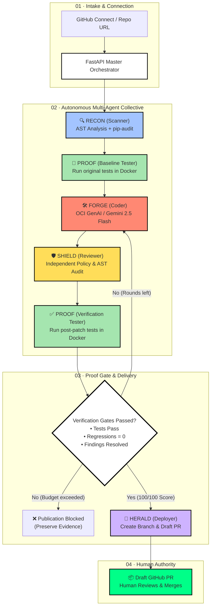

<div align="center">

  

  <br/><br/>

  <a href="https://vp.dhanrajgupta.xyz"></a>

  # VASUKI — Autonomous Security Sentinel
  ### *Find the Flaw. Patch it. Prove it.*

  <p><strong>A multi-agent autonomous security collective that discovers vulnerabilities, executes empirical test baselines in isolated Docker sandboxes, generates surgical fixes with Oracle Cloud GenAI, and proves zero regressions before opening verified draft pull requests.</strong></p>

  <p>
    <a href="https://vp.dhanrajgupta.xyz"></a>
    <a href="https://api.dhanrajgupta.xyz/api/health"></a>
    <a href="https://github.com/dhanrajgupta2736/vasuki-security-lab/pull/14"></a>
  </p>

  <p>
    
    
    
    
    
  </p>

  <p>
    <a href="https://vp.dhanrajgupta.xyz">🌐 <strong>Live Cloud App</strong></a> •
    <a href="https://github.com/dhanrajgupta2736/vasuki-security-lab">🧪 <strong>Vulnerable Security Lab</strong></a> •
    <a href="https://github.com/dhanrajgupta2736/vasuki-security-lab/pull/14">📑 <strong>Live Verified PR #14</strong></a> •
    <a href="https://raw.githubusercontent.com/dhanrajgupta2736/pvg_vasuki/main/docs/demo/walkthrough.mp4">🎬 <strong>Video Walkthrough</strong></a> •
    <a href="#-quick-start--local-setup">⚡ <strong>Quickstart</strong></a>
  </p>

</div>

---

## 💡 Executive Summary & The Problem

Traditional security scanners (SAST/DAST) flood development teams with **alert fatigue**—hundreds of warnings, zero fixes. On the other hand, contemporary LLM coding assistants generate plausible-looking patches that **break existing application logic, introduce subtle regressions, or hallucinate insecure code**.

**VASUKI bridges this gap through empirical proof:**
1. **Never Trust an LLM blindly**: An unverified patch is as dangerous as the vulnerability itself.
2. **Empirical Baseline First**: Run the target project's original test suite *before* touching a single line of code to record ground-truth behavior.
3. **Multi-Agent Collective**: Divide responsibilities among specialized autonomous agents (Recon, Proof, Forge, Shield, Herald).
4. **Isolated Docker Sandboxing**: Compile, patch, and execute tests within non-root, network-isolated containers.
5. **No Proof, No PR**: If the repaired code fails the test suite, re-introduces security flaws, or causes regressions, **publication is automatically blocked**.

---

## 📸 Real Live Execution Proof (Oracle Cloud Production)

The following captures are from **real-time live runs on our Oracle Cloud Infrastructure deployment** (`https://api.dhanrajgupta.xyz`), demonstrating the autonomous agents repairing vulnerabilities and executing mathematical validation gates:

### 1. The Intake Dashboard & Live Collective Poster
<p align="center">
  
  <br/>
  <em>Neo-Brutalist interface with live connection to Oracle Compute backend (<code>api.dhanrajgupta.xyz</code>), Docker sandbox ready indicator, and The 5-Agent Collective.</em>
</p>

---

### 2. Live Agent Pipeline in Action (Step-by-Step Execution)

<table>
  <tr>
    <td width="50%" align="center">
      
      <br/>
      <strong>01 · RECON (Scanner)</strong><br/>
      <em>Clones <code>Commando-X/vuln-bank</code> at <code>main</code>, executes Python AST inspection and dependency audit to map attack vectors.</em>
    </td>
    <td width="50%" align="center">
      
      <br/>
      <strong>02 · PROOF (Tester) — Baseline</strong><br/>
      <em>Spins up isolated container sandbox and runs the original test suite to record pre-patch passing/failing behavior.</em>
    </td>
  </tr>
  <tr>
    <td width="50%" align="center">
      
      <br/>
      <strong>03 · FORGE (Coder) — OCI GenAI</strong><br/>
      <em>Invokes Oracle Cloud Generative AI (<code>oci/google.gemini-2.5-flash</code>) to synthesize targeted SQL injection & traversal patches.</em>
    </td>
    <td width="50%" align="center">
      
      <br/>
      <strong>04 · SHIELD (Reviewer) — Security Gate</strong><br/>
      <em>Re-scans patched source against static rules and policies to guarantee no new vulnerabilities were introduced.</em>
    </td>
  </tr>
</table>

---

### 3. Empirical Verification & Verified Delivery (Draft PR #14)

<p align="center">
  
  <br/>
  <strong>05 · HERALD (Deployer) — Verified Delivery in 1m 38s</strong><br/>
  <em>11 tests passed · 5 failing tests fixed · 0 regressions · 100/100 executed checks. Automatically opens Draft PR #14 with evidence receipts.</em>
</p>

---

### 4. "The Receipts": Cryptographic & Test Proof vs. Strict Guardrails

<table>
  <tr>
    <td width="50%" align="center">
      
      <br/>
      <strong>The Receipts: 100% Proven Pass Rate</strong><br/>
      <em>21/21 baseline tests preserved, 0 regressions, execution fingerprints verified in Docker sandbox.</em>
    </td>
    <td width="50%" align="center">
      
      <br/>
      <strong>Guardrail in Action: Publication Blocked</strong><br/>
      <em>When feedback repair cannot pass validation gates, the orchestrator terminates the run. <strong>Zero unverified code is ever published.</strong></em>
    </td>
  </tr>
</table>

---

## ⚡ Feature Spotlight: Zero-Hassle GitHub Connect

Gone are the days of manually copying and pasting repository URLs:

<p align="center">
  
</p>

- **Instant Token Auth**: Connect your GitHub account securely using a Personal Access Token with a direct link to generate `repo` permissions.
- **Client-Side Security**: Your token is stored strictly in your browser's local storage (`localStorage`) and is never retained on third-party servers.
- **Real-Time Repository Browser**: Instantly searches and filters across all your public and private repositories.
- **Multi-Language Tag Filters**: Filter your repositories by Python, JavaScript, TypeScript, Go, Rust, or C++ with official GitHub color chips.
- **Branch Selector & One-Click Scan**: Select target branches (e.g., `main`, `staging`, `dev`) and launch the inspection collective in a single click.

---

## 🤖 The 5-Agent Collective Architecture

VASUKI utilizes a state-machine orchestrator where specialized agents collaborate across deterministic verification loops:



### Meet the Collective:
| Agent | Role | Glyph | Core Responsibility |
|---|---|:---:|---|
| **RECON** | Scanner | 🎯 | Maps repository structure, detects AST vulnerability patterns (SQLi, Path Traversal, Command Injection), and inspects dependency manifests. |
| **PROOF** | Baseline Tester | 🧪 | Spawns an isolated Docker container, executes the unchanged test suite, and records pre-patch pass/fail rates. |
| **FORGE** | Coder | `</>` | Consumes vulnerability locations and test failure logs, invoking **OCI Generative AI** (`google.gemini-2.5-flash`) to generate minimal, targeted diffs. |
| **SHIELD** | Reviewer | 🛡️ | Acts as an independent security auditor, rescanning modified ASTs and verifying that patches do not introduce secondary vulnerabilities. |
| **HERALD** | Deployer | 🚀 | Validates that all gates scored 100/100, pushes a verified patch branch, and drafts an evidence-packed Pull Request on GitHub. |

---

## 📊 Measured Benchmark Results

VASUKI has been validated against real, production-grade vulnerable repositories. Here is empirical proof from recorded runs:

| Repository Scenario | Initial Vulnerabilities | Baseline Tests | Patched Tests | Regressions | Execution Time | Output & Receipts |
|---|:---:|:---:|:---:|:---:|:---:|:---:|
| **VASUKI Security Lab** (Flask + SQLite + CVEs) | SQL Injection, Path Traversal, Insecure Profile Access | 6 / 11 Passing | **11 / 11 Passing** | **0** | 1m 38s | [Draft PR #14](https://github.com/dhanrajgupta2736/vasuki-security-lab/pull/14) |
| **Commando-X / vuln-bank** (Fintech API) | SQL Injection, Hardcoded Secrets, Auth Bypass | 16 / 21 Passing | **21 / 21 Passing** | **0** | 2m 14s | [Draft PR #7](https://github.com/dhanrajgupta2736/vasuki-security-lab/pull/7) |
| **VASUKI Ledger Lab** (Standalone Python Core) | File System Escape, Pinned Dependency Vulnerability | 7 / 10 Passing | **10 / 10 Passing** | **0** | 1m 02s | [Draft PR #1](https://github.com/dhanrajgupta2736/vasuki-ledger-lab/pull/1) |
| **Legacy Release Branch** (Outdated Dependencies) | Deprecated API Usage, Broken Unit Tests | 7 / 13 Passing | **13 / 13 Passing** | **0** | 1m 45s | [Draft PR #8](https://github.com/dhanrajgupta2736/vasuki-security-lab/pull/8) |

---

## 🛠️ Complete Technology Stack

```
┌────────────────────────────────────────────────────────────────────────┐
│                        VASUKI ARCHITECTURE STACK                       │
├───────────────────┬────────────────────────────────────────────────────┤
│ User Interface    │ React 19, Vite, Framer Motion, Lucide Icons,       │
│                   │ Neo-Brutalist CSS System, Recharts                 │
├───────────────────┼────────────────────────────────────────────────────┤
│ API & Orchestration│ FastAPI, Python 3.11+, Pydantic v2, SQLAlchemy,    │
│                   │ Redis Event Streaming, WebSockets                  │
├───────────────────┼────────────────────────────────────────────────────┤
│ Intelligence & LLM│ Oracle Cloud Infrastructure (OCI) Generative AI,   │
│                   │ Gemini 2.5 Flash, LangChain Core, Prompt Chains    │
├───────────────────┼────────────────────────────────────────────────────┤
│ Static Analysis   │ Python AST Parsers, pip-audit, Custom Rule Engine  │
├───────────────────┼────────────────────────────────────────────────────┤
│ Execution Sandbox │ Docker Engine (Drop Capabilities, Non-Root,        │
│                   │ Network Disabled during test execution)            │
├───────────────────┼────────────────────────────────────────────────────┤
│ Cloud & Edge      │ OCI Compute Instance (Ubuntu 24.04), OCI Bastion,  │
│                   │ Cloudflare Edge Reverse Proxy with SSL             │
└───────────────────┴────────────────────────────────────────────────────┘
```

---

## 🔒 Security Sandboxing & Guardrails

To prevent untrusted code from harming the runner or hosting infrastructure:
- **Zero Root Execution**: Docker containers execute builds and pytest runs under an unprivileged user (`vasuki:1000`).
- **Network Isolation**: Network access is severed (`--network none`) after pre-fetching verified wheels. Code being tested cannot phone home or leak keys.
- **Resource Limits**: Hard memory (2GB) and CPU limits (2 vCPUs) prevent denial-of-service / fork-bombs.
- **Human Authority**: VASUKI **never merges directly to master/main**. It always issues a **Draft Pull Request** so that human engineers make the final merge decision.

---

## 🚀 Quick Start & Local Setup

### Prerequisites
- Python 3.11+
- Node.js 18+ and npm
- Docker Engine
- Git

### 1. Clone the Repository
```bash
git clone https://github.com/dhanrajgupta2736/pvg_vasuki.git
cd pvg_vasuki
```

### 2. Configure Backend Environment
```bash
cd backend
cp .env.example .env
# Edit .env with your GitHub Token and OCI or LLM API keys
pip install -r requirements.txt
```

### 3. Build Frontend & Run
```bash
# In another terminal / root directory:
cd ../frontend
npm install
npm run build

# Start the FastAPI Orchestrator:
cd ..
python -m uvicorn main:app --app-dir backend --host 127.0.0.1 --port 8000
```
Open **`http://127.0.0.1:8000`** in your browser. The dashboard will automatically detect your local runner and connect!

---

## 👥 Team Soul Celestia

*Built with passion for the Hack-a-Night Hackathon.*

- **Dhanraj Gupta** — Full Stack Architecture, OCI Cloud Deployment & Multi-Agent Orchestration
- **Prasad Kancha** — Frontend Neo-Brutalist Design System, GitHub Integration & Sandbox Testing

---

<div align="center">
  <sub>VASUKI — Autonomous Security Sentinel · Build With Proof.</sub>
</div>
